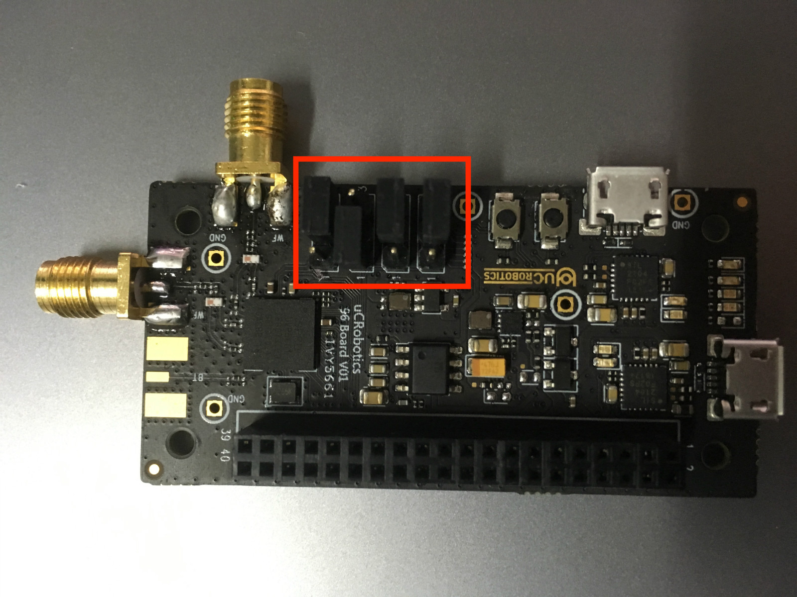

## Linux host
This section shows how to flash IVY5661 with a Linux machine. There will be five steps.  

***
*Step 1: Prepare Necessary Software*  
*Step 2: Set IVY5661 to ROM Code Mode*  
*Step 3: Connect IVY5661 with Host Machine*   
*Step 4: Flash IVY5661*  
*Step 5: Reboot Your IVY5661*

---

### Step 1: Prepare Necessary Software  
***dloader*** is a necessary tool from Unisoc for flashing IVY5661 on Linux host machine. You can either download the prebuild deb package [here](https://github.com/unisoc/dloader/releases/download/unisoc-v0.3.1/dloader_0.3.1-1_amd64.deb), or build it from source.  

*How to build:*  
```$ git clone https://github.com/unisoc/dloader.git```  
```$ ./configure```  
*Note: Building dloader may use automake-1.14 which is in Debian Jessie or Ubuntu Trusty. Please check use the command ```automake --version``` to check the version.  
```$ make && sudo make install```   

---

### Step 2: Set IVY5661 to ROM Code Mode  
Switch bootstrap pin to ROM Code Mode, which is ```3-2, 1-2, 3-2, 3-2```    

  

-

### Step 3: Connect IVY5661 with Host Machine  
Connect UART0 on IVY5661 to your host machine(Linux) with the USB to MicroUSB cable. If they are connected correctly, you will find the new device.   

---  

### Step 4: Flash IVY5661
Enter the where binary files locate.  
For example, if you follow the [Build IVY5661 frome source](../build/linux.md), the workspace will be ```~/workspace/unisoc_zephyr_sdk/output/repeater/images```.  
Running command ```./update_fw.sh```, the board will flashed automatically.  
Sections and procegree bar will be showed while flashing.  

---  

### Step 5: Reboot Your IVY5661
Before reboot your IVY5661, you need to swich the bootstrap pin to NOR FLASH mode, which is ```3-2, 1-2, 3-2, 3-2```    

  

Then you can push the reset button and the board will be reset and reboot.  

 
